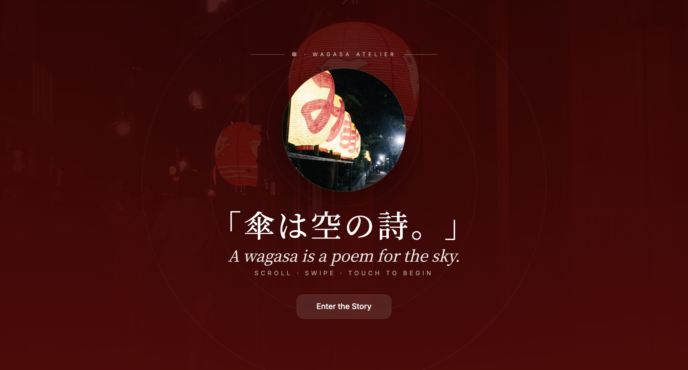
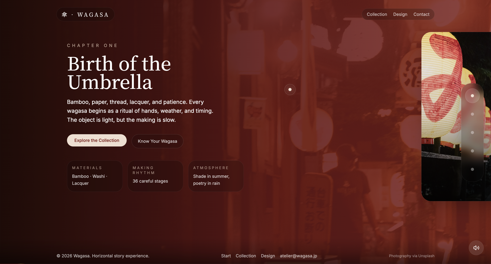
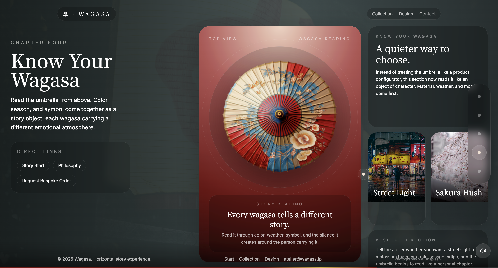

# Wagasa








An immersive horizontal storytelling website inspired by traditional Japanese wagasa craftsmanship. The experience is built as a cinematic single-page journey with layered imagery, ambient transitions, and a bespoke reading section that explores color, season, and symbolism.

## Highlights

- Horizontal scroll narrative across five chapters
- Cinematic intro screen and persistent progress indicator
- Bespoke wagasa reading section with layered editorial cards
- Responsive Next.js app with Tailwind-based styling
- Custom navigation, cursor trail, and atmospheric motion details

## Stack

- Next.js 15
- React 19
- TypeScript
- Tailwind CSS
- Radix UI primitives
- Lucide React icons

## Run Locally

```bash
npm install
npm run dev
```

Open `http://localhost:3000`.

## Project Structure

```text
app/                  App router entry points and global styles
components/           Story sections, navigation, and UI building blocks
public/               Static assets, logos, and screenshots
lib/                  Shared utility helpers
```

## Notes

- Main page experience: `app/page.tsx`
- Site metadata and fonts: `app/layout.tsx`
- Wagasa reading panel: `components/wagasa-configurator.tsx`

## License

This project is for personal portfolio and showcase use.
